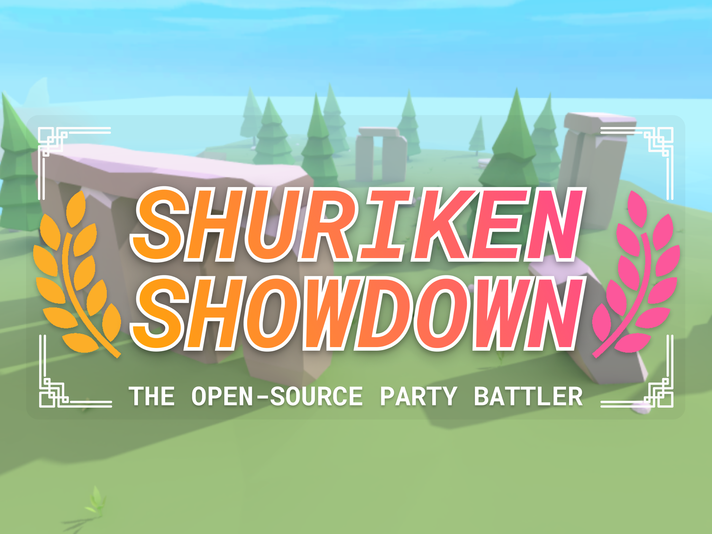

# Shuriken Showdown

*A party battler VR game inspired by Boomerang Fu*

## Open Source License

While Shuriken Showdown is licensed under MPL-2.0, certain assets that I have imported from the Unity Asset Store and itch.io are not included under this license. Those assets have been excluded from this repository and their names can be found under the .gitignore file. This means that if you were to download this project and try to run it on your local machine, you'd likely encounter errors due to the missing assets unless you were to obtain them yourself.

The purpose of open sourcing this project is to help others who are making complex Udon games, as there are surprisingly few examples available online. By sharing my code, I hope to provide a useful reference for others. I'd highly recommend reading through the source code under [Assets/UdonSharp](https://github.com/IdreesInc/Shuriken-Showdown/tree/main/Assets/UdonSharp) to understand how I implemented various features in the game, especially the multiplayer networking architecture as navigating the limitations of Udon was a challenging problem. I hope that this project helps you along in your own development, and if you wish to get in touch, feel free to reach out to me on [Discord](https://discord.gg/6yxE9prcNc).